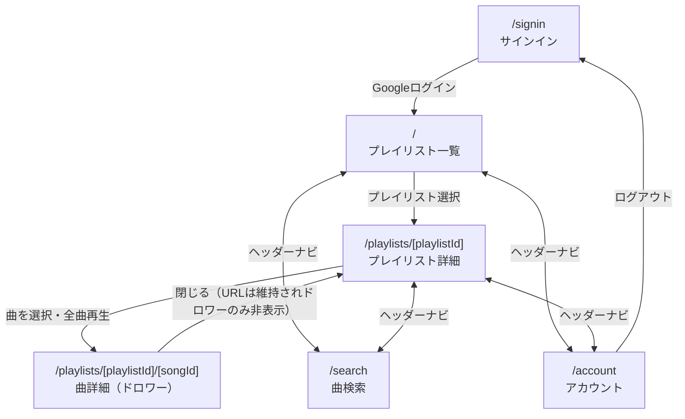

# 機能仕様書

## 概要

外部の音楽サービス API を利用した音楽プレイヤー。Google アカウントでログインし、自分のプレイリストの曲を検索・追加・再生できる。外部サービスとの連携は adapter 層を介しており、現在は YouTube を利用する実装が有効になっている（詳細は「アーキテクチャ（外部サービス連携）」を参照）。

## 技術スタック

- Next.js 16 (App Router) / React 19 / TypeScript
- Auth.js (NextAuth v5, beta) + Google OAuth
- Tailwind CSS 4 / CVA
- YouTube Data API v3 / YouTube IFrame Player API（現在有効な vendor）

## アーキテクチャ（外部サービス連携）

音楽サービスとの連携は `src/service` 配下の adapter 層を介して行い、アプリの他の部分（`features/playlist`・`features/song`・`features/user`・`features/player` など）は具体的なサービス名を意識しない。

- `src/service/adapter.ts`：プレイリスト・曲検索・クォータ取得・認証スコープを表す `ServiceAdapter` インターフェースと、現在有効な vendor を指す `serviceAdapter`（サーバー専用）
- `src/service/player.ts`：再生コントローラを表す `PlaybackController` インターフェースと、現在有効な vendor の再生実装を指す `createPlaybackController`（ブラウザ専用。データ取得系の adapter とはサーバー/クライアントの実行環境が異なるため別ファイルに分離している）
- `src/service/vendors/youtube/`：現在有効な YouTube 向けの実装一式（`api.ts`＝生の HTTP クライアント、`adapter.ts`＝`ServiceAdapter` の実装、`player.ts`＝YouTube IFrame Player API を使った再生コントローラ、`authScope.ts`＝OAuth スコープ）

別のサービスに差し替える場合は、`vendors/` 配下に同じ構成の新しい vendor を追加し、`adapter.ts`・`player.ts` の参照先を差し替える。OAuth の認証方式自体（現在は Google ログイン）がサービスによって異なる場合は `src/auth.ts` の変更も必要になる。

## 認証

- Google OAuth（`next-auth`）でログインする。スコープに `https://www.googleapis.com/auth/youtube` を含み、YouTube Data API をユーザー本人の権限で呼び出す。
- アクセストークンが期限切れの場合はリフレッシュトークンで自動更新する（`src/auth.ts`）。
- ルートグループで未ログイン導線とログイン後導線を分離する。
  - `app/(auth)`：未ログイン時の画面（`/signin`）
  - `app/(main)`：ログイン後の画面。`app/(main)/layout.tsx` でセッションを検証し、未ログインなら `/signin` へリダイレクトする。

## 画面・ルーティング

| パス                               | 画面               | 概要                                                                     |
| ---------------------------------- | ------------------ | ------------------------------------------------------------------------ |
| `/signin`                          | サインイン         | Google ログインボタンのみ                                                |
| `/`                                | プレイリスト一覧   | 自分の YouTube プレイリスト一覧。再生中のプレイリストをハイライト表示    |
| `/playlists/[playlistId]`          | プレイリスト詳細   | プレイリスト名変更・曲一覧・全曲再生ボタン                               |
| `/playlists/[playlistId]/[songId]` | 曲詳細（ドロワー） | 再生中の曲の詳細パネル（デスクトップはサイドパネル、モバイルは全画面）   |
| `/search`                          | 曲検索             | YouTube 動画（カテゴリ: 音楽）を検索し、選択したプレイリストへ追加・削除 |
| `/account`                         | アカウント         | プロフィール・API クォータ使用量・ログアウト                             |

`app` 配下はルーティングとデータ取得のみを担当し、表示は `src/features/**/pages` に実装する。

### 画面遷移図

`/`・`/search`・`/account` はヘッダーから常時遷移可能なグローバルナビゲーション。曲詳細（ドロワー）は独立画面ではなく、プレイリスト詳細に重ねて表示される。

## プレイリスト機能

- 一覧・詳細ともに `serviceAdapter` 経由で取得（`src/features/playlist/api.ts`）。
- 名前変更：`PlaylistTitleUpdate` コンポーネントから `updatePlaylist`（`serviceAdapter.updatePlaylist`。YouTube vendor では `playlists.update` を呼び出す）を実行する。鉛筆アイコンで入力欄に切り替え、チェックで保存・× でキャンセル。
- 曲の追加/削除：`/search` 画面、またはプレイリスト詳細の曲一覧（`PlaylistSongList`）から `registerPlaylistSong`/`deletePlaylistSong`（`serviceAdapter` 経由。YouTube vendor では `playlistItems.insert`/`playlistItems.delete` を呼び出す）を実行する。
- 再生中プレイリストのハイライト：一覧画面の `PlaylistCard` が再生中の `playlistId` と一致する場合、背景色・文字色を強調表示する。

## 検索機能

- `serviceAdapter.searchSongs` で曲を検索する（YouTube vendor では `search.list` を `videoCategoryId=10`＝音楽で呼び出す）。
- 検索結果の各曲を、選択中のプレイリストへワンタップで追加・削除できる。

## 再生機能（プレイヤー）

再生状態はアプリ全体で共有される React Context（`PlayerProvider` / `usePlayer`、`src/features/player/hook.ts`）で管理し、`createPlaybackController`（`src/service/player.ts`）が生成する再生コントローラで実際の再生を行う。

### UI

- ミニプレイヤー（`PlayerMiniPlayer`）：画面下部に固定表示。曲名・再生位置バー・再生/一時停止・前後スキップ。
- ドロワー（曲詳細パネル）（`PlayerSongDetail`。デスクトップは `PlayerSongDetailPanel`、モバイルは `PlayerSongDetailDrawer` でラップ）：デスクトップはプレイリスト詳細の横にサイドパネルとして常設、モバイルは全画面表示に切り替え。シーク・シャッフル・リピート・前後スキップを操作できる。
- ドロワーの表示条件は「再生中の曲が属するプレイリストのページを閲覧中」かつ「`activeMobileView` が `player`」であること。無関係のページを見ている間はドロワーを表示しない。

### 再生操作

- 再生開始：曲一覧・全曲再生ボタンから明示的に再生した場合は即座に自動再生する。
- 曲の直接アクセス（曲詳細 URL への直接遷移・リロード）：`PlayerSongAutoLoad` が該当曲を一時停止状態でロードする（localStorage に保存された再生位置があれば復元、なければ 0 秒）。ユーザー操作なしに再生が始まることはない。
- 前後スキップ・自動送り：`playNext`/`playPrevious`、および曲終了時の自動送りで次の曲へ切り替える。曲終了時、リピートが「全曲」でもシャッフルでもなく最後の曲の場合は停止する。
- シャッフル・リピート（オフ / 全曲 / 1 曲）を切り替え可能。
- 曲の自動送りで URL（ブラウザアドレスバー）を同期するのは、現在閲覧中のページが該当プレイリスト配下にある場合のみ。無関係のページを見ている間に自動送りが発生しても URL やパネル表示に影響しない。

### 再生状態の永続化・復元（localStorage）

- 再生中は曲情報・プレイリスト情報・曲一覧・再生位置・ログインユーザーのメールアドレスを `localStorage`（キー: `player-playback-state`）へ継続的に保存する。
- トップページ表示時（`PlaybackRestore`）に、保存されているユーザーのメールアドレスと現在ログイン中のユーザーが一致する場合のみ、直前の再生状態（曲・プレイリスト・再生位置）を一時停止状態で復元する（ミニプレイヤー表示・位置復元。自動再生はしない）。
- 復元・直接アクセスいずれの場合も、再生コントローラの生成完了後に該当位置へシークし、明示的に一時停止する。

## アカウント機能

- プロフィール（アイコン・名前・メールアドレス）を表示。
- 音楽サービス API の 1 日あたりの割り当て（クォータ）使用量をリング表示・数値表示する。
- ログアウトすると `/signin` へリダイレクトする。

## API クォータ管理

- サーバー側のメモリ上でその日の API 呼び出し回数を記録し（`src/service/vendors/youtube/api.ts`）、日付が変わるとリセットする。
- ヘッダー・アカウント画面でクォータ使用量を可視化する。

## 環境変数

| 変数名                      | 用途                                  |
| --------------------------- | ------------------------------------- |
| `AUTH_SECRET`               | Auth.js のセッション署名鍵            |
| `AUTH_GOOGLE_CLIENT_ID`     | Google OAuth クライアント ID          |
| `AUTH_GOOGLE_CLIENT_SECRET` | Google OAuth クライアントシークレット |

Vercel 等へデプロイする場合は、上記をデプロイ先の Production 環境変数として登録し、Google Cloud Console の OAuth クライアントに本番ドメインのリダイレクト URI（`https://<ドメイン>/api/auth/callback/google`）を追加する。
